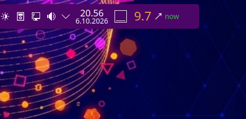

# Glucoid

A lightweight glucose badge for the KDE Plasma 6 panel.

Glucoid shows the latest sensor glucose reading from any Nightscout-compatible
API - a Nightscout site, a Nightscout proxy, or the web server built into the
Juggluco app on your phone - directly in your Plasma panel. It is a single QML
plasmoid: no background service, no helper program, no extra packages.



## Features

- **Panel badge**: the latest value, a trend arrow (diagonal = slow change,
  straight = fast, doubled = very fast) and how old the reading is ("now" in
  green).
- **Click the badge**: a card with the delta, the age, the trend arrow and a
  gear that opens the widget's settings.
- **Colours tell you at a glance where you are**: green on target, amber
  outside the target range, red beyond the low/high limits, grey when the
  reading is stale or the connection has failed. Those four colours are fixed
  on purpose, so they mean the same thing in every theme.
- **Fits your desktop**: the card, its border, all texts and the settings page
  follow the system colour scheme, so the widget looks right in light and dark
  themes.
- **Three ways to authenticate**: an access token (Nightscout), the API secret,
  or no authentication at all for public read-only pages. If the chosen
  credential style answers `403`, the widget retries once with the other style.
- **Thresholds are optional**: there are no defaults - set the ones you want. A
  field left empty simply switches that warning off, and with none of them set
  the value is shown in the theme's normal text colour.
- **mmol/l or mg/dl**, whichever you use.
- **Advanced**: the poll interval (minimum 15 s) and the limit after which a
  reading counts as stale.

## Requirements

KDE Plasma 6 - built and tested on Plasma 6.6.6 / Qt 6.10.2 (Kubuntu).

Nothing else is needed: the widget uses only the QML modules that Plasma
already ships, it installs no packages and runs no background service. Network
access to your Nightscout-compatible API is required - either the phone on the
same LAN (the Juggluco web server, `http://<phone-ip>:17580`) or your
Nightscout site on the internet (HTTPS recommended there). The installed size
is about 105 KB.

## Install

With the KDE Plasma 6 tools:

```sh
kpackagetool6 -t Plasma/Applet -i glucoid-1.1.0.plasmoid
```

If an older version is already installed, upgrade it instead:

```sh
kpackagetool6 -t Plasma/Applet -u glucoid-1.1.0.plasmoid
```

or right-click the panel and choose *Enter Edit Mode -> Add Widgets... -> Get
New Widgets -> Install Widget from Local File...*. Then drag **Glucoid** into
the panel. The widget is also available on the KDE Store.

## Settings

Right-click the widget -> *Configure Glucoid*, or click the gear in the card.

| Field | Meaning |
| --- | --- |
| Address | The Nightscout-compatible API, e.g. `https://your-site.example` or `http://<phone-ip>:17580` for the Juggluco web server |
| Authentication | *Access token* (Nightscout), *API secret*, or *No authentication* for public read-only sites |
| Credential | The token or the API secret (hidden when authentication is off) |
| mmol/l | Show mmol/l instead of mg/dl; the thresholds use the same unit |
| Low / High | Beyond these the number turns red |
| Target bottom / top | Outside this range the number turns amber |
| Advanced: poll interval | How often the widget fetches (15-3600 s, default 60) |
| Advanced: stale after | After how many minutes a reading is shown as stale (0 = never) |

## Where the data comes from

Any Nightscout-compatible API. When an access token is used, the widget asks
for a JWT first and then reads `/api/v3/entries`, falling back to
`/api/v2/entries/sgv` and `/api/v1/entries.json`. With an API secret or with no
authentication it starts from the plain v1 endpoint and walks the same chain.
The widget never writes to the API.

## Build the package

```sh
tools/make-package.sh          # -> dist/glucoid-1.1.0.plasmoid
```

The build is byte-for-byte reproducible: the script copies the files with
their timestamps intact, so two runs produce the same file.

## Tests

The settings page has regression tests that run the real QML page and drive it
with key events:

```sh
/usr/lib/qt6/bin/qmltestrunner -input tests/tst_configgeneral.qml
LC_ALL=fi_FI.UTF-8 /usr/lib/qt6/bin/qmltestrunner -input tests/tst_configgeneral.qml
```

The second form is worth running: with the Finnish number format the decimal
separator is a comma, which is exactly the case that once broke typing
decimals into the threshold fields.

For manual testing of the data path and the error cases there is a fake
Nightscout server:

```sh
python3 tests/fake-nightscout.py          # 127.0.0.1:18081
echo single > /tmp/glucoid-fake-mode      # two | ascending | single | empty | garbage | http500 | old | secret403
```

Point a test copy of the widget at `http://127.0.0.1:18081` and watch the
widget's `console.log` output (see the file header for the whole procedure).

## Repository layout

```
plasmoid/fi.reijo.glucoid/   the widget itself (metadata.json + contents/**)
packaging/                   the README and the GPLv3 text that go into the package
tests/                       regression tests and the fake Nightscout server
tools/                       the packaging script
screenshots/                 the pictures used in this README
```

## Licence

**GPL-3.0-or-later** - see `LICENSE`. Copyright (C) 2026 Reijo Kinnunen.

The design was inspired by the Owlet Nightscout widget; this is an independent
implementation and contains no code from it.
